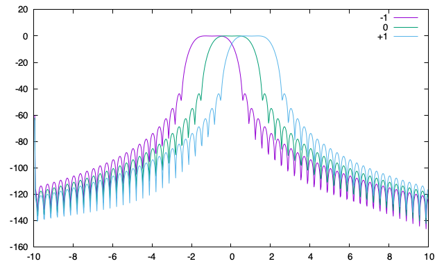

# Mixed Radix Decimation in Time FFT in JavaScript

## Supported Transform Lengths

This FFT implementation supports transform lengths that are composites of 2, 3, 5, and 7 only. In other words, a valid transform length must have no prime factors other than 2, 3, 5, or 7. For example, lengths such as 256 (2⁸) and 44100 (2²·3²·5²·7²) are supported, while numbers with other prime factors are not.

## Short Time Fourier Tranform

